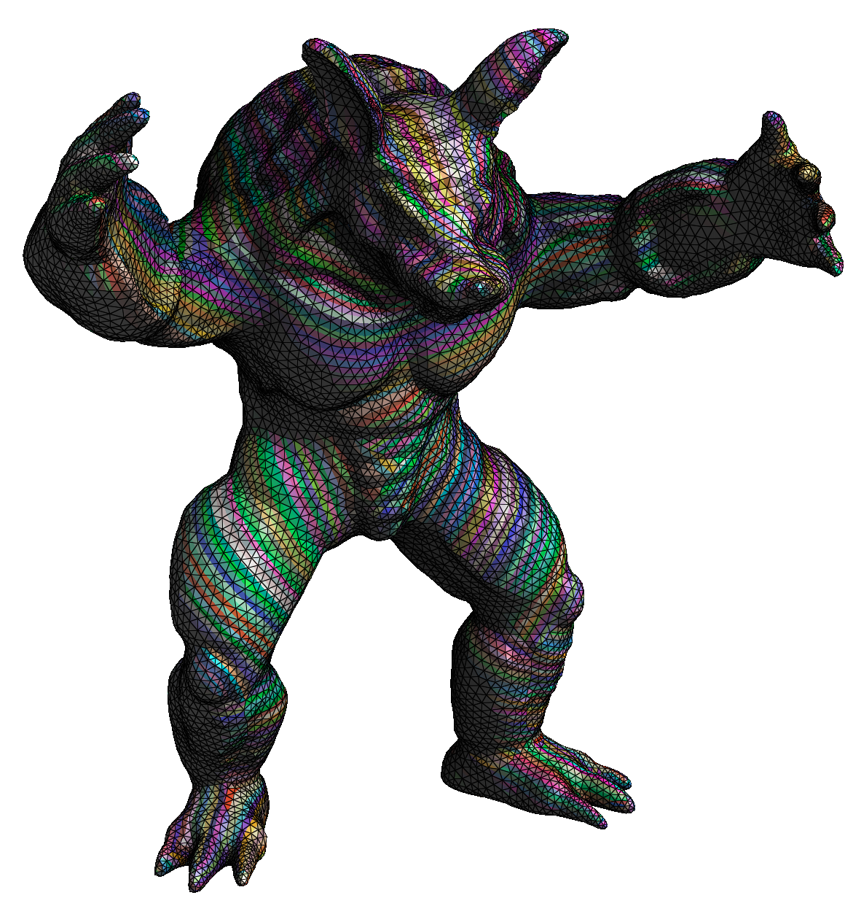
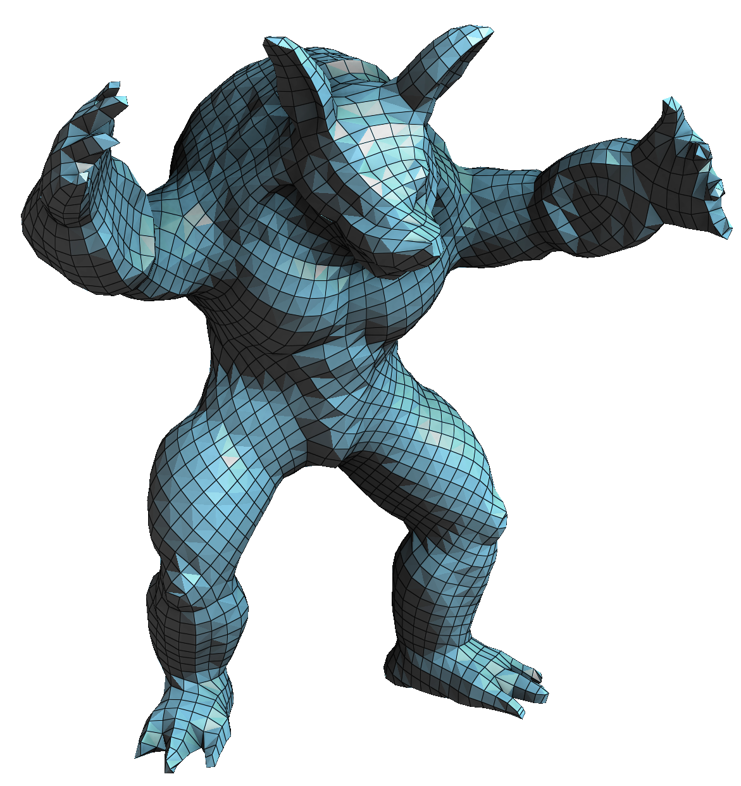
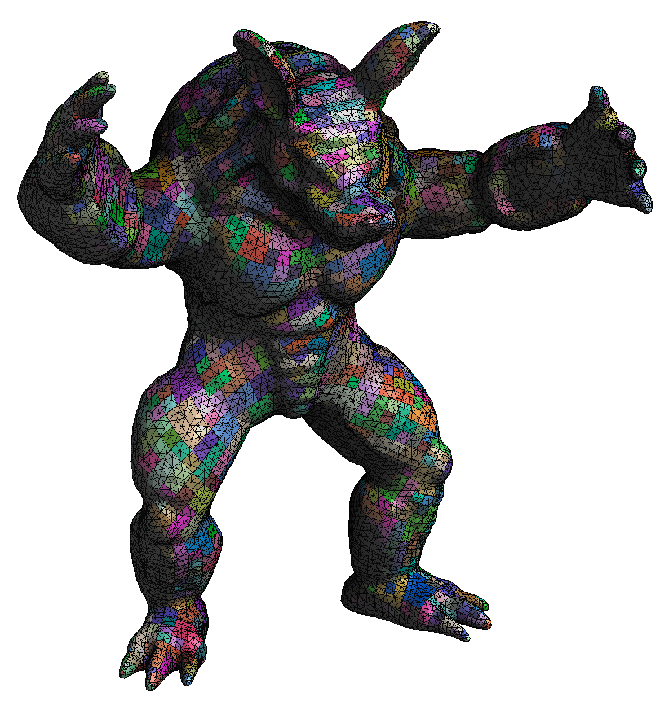

libQEx – A Robust Quad Mesh Extractor
======

| Input (tri) | Output (quad) | Output (poly) |
| :---: | :---: | :---: |
|  |  |  |

## Changes compared to the original libQEx

This is a fork of the original `libQEx`: the extraction algorithm itself is untouched,
but the build system and the API surface around it were reworked, and the **quad layout
that the extractor computes internally is now exposed** as a polygonal mesh.

### Dependency and build refactoring

* **Dependencies are git submodules** instead of something you have to install by hand:
  * `third_party/OpenMesh` — [OpenMesh](https://gitlab.vci.rwth-aachen.de:9000/OpenMesh/OpenMesh),
    pinned to the tag `OpenMesh-11.0`. It carries a nested submodule of its own
    (`cmake-library`), so clone with `--recurse-submodules`, or run
    `git submodule update --init --recursive` afterwards. No separate OpenMesh
    installation is needed any more.
  * `third_party/CLI11` — [CLI11](https://github.com/CLIUtils/CLI11) (v2.x), used by the
    `qex` application.
  * `geogram` stays optional and is detected automatically (`~/geogram`, or an installed
    copy); `-DGEOGRAM_ROOT=<path>` points at a geogram source tree, `-DQEX_WITH_GEOGRAM=OFF`
    disables the bridge.
  * `-DQEX_OPENMESH=AUTO|SUBMODULE|SYSTEM` selects between the bundled OpenMesh and an
    installed one. `cmake/FindOpenMesh.cmake` is used for the latter; `cmake/FindGeogram.cmake`
    was added for geogram.
* **CMake refactoring**: C++17, target based linking and usage requirements, config aware
  output directories — every executable ends up in `<build>/bin`, every library in
  `<build>/lib`.
* **New build targets**: the `QExGeogram` bridge library, the `qex` application
  (`apps/qex`) and the demos `export_layout` / `export_geogram`, next to the pre-existing
  `cmdline_tool` and `minimal_c`.
* A pre-existing bug was fixed on the way: `QuadExtractorPostprocT::create_face()` now
  transfers the per-halfedge local UVs (it used to be a `TODO`, which left the local UV
  property of rebuilt faces uninitialised after `mergePolyToQuad()`).

### Polymesh / quad layout support (new)

While extracting, QEx traces every quad edge through the triangle mesh. Those traces are
now recorded, which makes the quad layout available as a genuine **subdivision of the
triangle mesh** — the “polymesh”, i.e. the triangle mesh cut along all quad edge
polylines — together with

* the **quad edge polylines** on the triangle mesh surface (one chain of points per quad edge),
* the **correspondence** between quad mesh faces, cells and triangle mesh faces,
* per vertex / edge / facet / facet-corner labels stating where each element comes from.

API: `QEx::SurfaceLayout` plus `QEx::extractQuadMeshWithLayout()`.
Writers: `demo/export_layout` (OBJ + correspondence table) and the `GeogramBridge`
(`toRefinedMesh()`, `toQuadMesh()`, `save()`), which stores *all* of the above in
`GEO::Mesh` **attributes** (`kind`, `tri_vertex`, `tri_edge`, `grid_vertex`, `cell`,
`tri_face`, `tri_faces_nb`, `quad_face`, `quad_edge`, `quad_edge_step`, `poly_face`,
`border`), so exporting to `.geogram` loses nothing. Attributes that can be "not there"
are `int` (holding -1), all others are `unsigned int`.

Measurements and the verification protocol are documented in
[`PROGRESS_quad_layout_export.md`](PROGRESS_quad_layout_export.md).

### Building

```bash
git clone --recurse-submodules <this repository>
cmake -S . -B build
cmake --build build
```

(Without `--recurse-submodules`: `git submodule update --init --recursive`.)

Optional dependency selection:

```bash
cmake -S . -B build -DQEX_OPENMESH=SYSTEM      # use an installed OpenMesh (e.g. brew install open-mesh)
cmake -S . -B build -DQEX_OPENMESH=SUBMODULE   # require the bundled one (default: AUTO)
cmake -S . -B build -DGEOGRAM_ROOT=~/geogram   # where to find geogram
cmake -S . -B build -DQEX_WITH_GEOGRAM=OFF     # build without the geogram bridge
```

Executables go to `build/bin`, libraries to `build/lib`.

### Using the `qex` command line application

`qex` replaces the former `demo/cmdline_tool` (and can do what the two export demos do,
partly):

```bash
build/bin/qex --in <input.obj> --out <output.obj> [-v|--valences <file.vval>] [--out-poly <file>]
```

`--out` and `--out-poly` also accept a directory, in which case the file names are derived
from the input mesh (`<input>_quad.obj`, `<input>_poly.geogram`). `--out-poly` writes the
polymesh described above as a geogram mesh (with all attributes). Run
`build/bin/qex --help` for the details.

---

`libQEx` is an implementation of [QEx](https://www.graphics.rwth-aachen.de/publication/03204/) \[[Ebke et al. 2013](http://dx.doi.org/10.1145/2508363.2508372)\] distributed under GPLv3. Commercial licensing is available upon request.

If you make use of `libQEx` in your scientific work, please cite our paper. For your convenience,
you can use the following bibtex snippet:

    @article{Ebke:2013:QRQ:2508363.2508372,
     author = {Ebke, Hans-Christian and Bommes, David and Campen, Marcel and Kobbelt, Leif},
     title = {{QE}x: Robust Quad Mesh Extraction},
     journal = {ACM Trans. Graph.},
     issue_date = {November 2013},
     volume = {32},
     number = {6},
     month = nov,
     year = {2013},
     issn = {0730-0301},
     pages = {168:1--168:10},
     articleno = {168},
     numpages = {10},
     url = {http://doi.acm.org/10.1145/2508363.2508372},
     doi = {10.1145/2508363.2508372},
     acmid = {2508372},
     publisher = {ACM},
     address = {New York, NY, USA},
     keywords = {integer-grid maps, quad extraction, quad meshing},
    }

## What is QEx?

QEx (pronounced \'kyü-eks\\) is a method for robust quad mesh extraction from Integer-Grid Maps with imperfections.
(Imperfect) Integer-Grid Maps are what is generated by most state-of-the-art quad meshing methods such as
QuadCover \[[Kälberer et al. 2007](http://dx.doi.org/10.1111/j.1467-8659.2007.01060.x)\] or
our own [Mixed-Integer Quadrangulation](https://www.graphics.rwth-aachen.de/publication/0344/)
\[[Bommes et al. 2009](http://dx.doi.org/10.1145/1576246.1531383)\].

Quad extraction is often believed to be a trivial matter but quite the
opposite is true: numerous special cases, ambiguities induced by
numerical inaccuracies and limited solver precision, as well as imperfections in the
maps produced by most methods (unless costly countermeasures are taken)
pose significant challenges to the quad extractor.

Read [our paper](https://www.rwth-graphics.de/publication/03204/) if you want to find out why quad extraction is complicated and
how we tackle it or skip ahead and download the source code if you
don't care about the details and just need results.

## License

`libQEx` is free software: you can redistribute it and/or modify it under
the terms of the GNU General Public License as published by the Free
Software Foundation, either version 3 of the License, or (at your
option) any later version. See [http://www.gnu.org/licenses/](http://www.gnu.org/licenses/).

If you make use of `libQEx` in scientific work we kindly ask you to cite our
paper. (You can use the bibtex snippet above.)

*Commercial licensing* under negotiable terms is available upon request. Please send an email to [ebke@cs.rwth-aachen.de](mailto:ebke@cs.rwth-aachen.de) if you are interested.


## Bibliography

[Bommes, D., Zimmer, H., and Kobbelt, L. 2009. Mixed-integer quadrangulation. In Proc. SIGGRAPH 2009.](http://dx.doi.org/10.1145/1576246.1531383)

[Ebke, H.-C., Bommes, D., Campen, M., and Kobbelt, L. 2013. QEx: Robust Quad Mesh Extraction. ACM Trans. Graph., 32(6):168:1–168:10, November 2013.](http://dx.doi.org/10.1145/2508363.2508372)

[Kälberer, F., Nieser, M., and Polthier , K. 2007. Quadcover - surface parameterization using branched coverings. Computer Graphics Forum 26, 3, 375–384.](http://dx.doi.org/10.1111/j.1467-8659.2007.01060.x)
